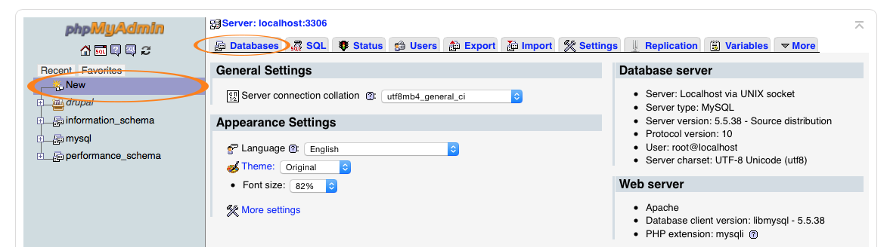
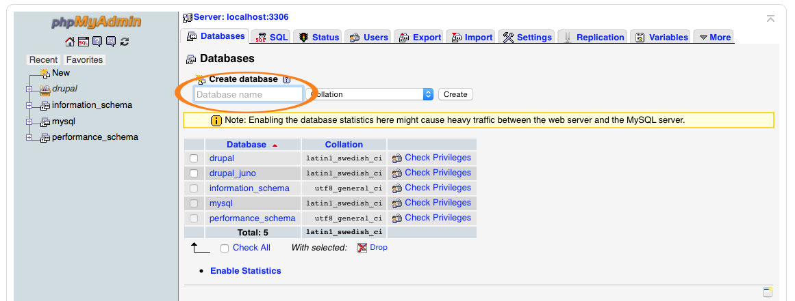
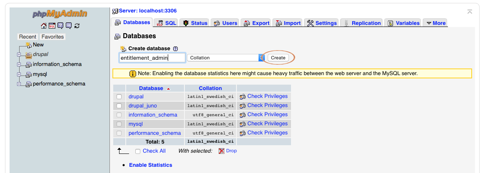
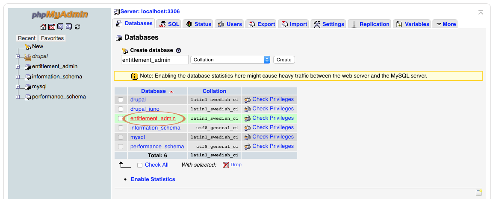
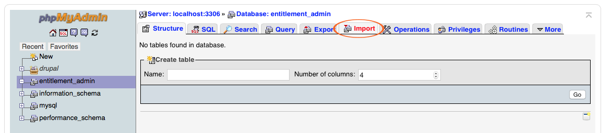
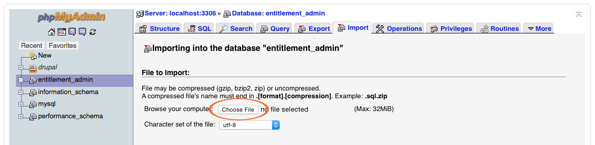
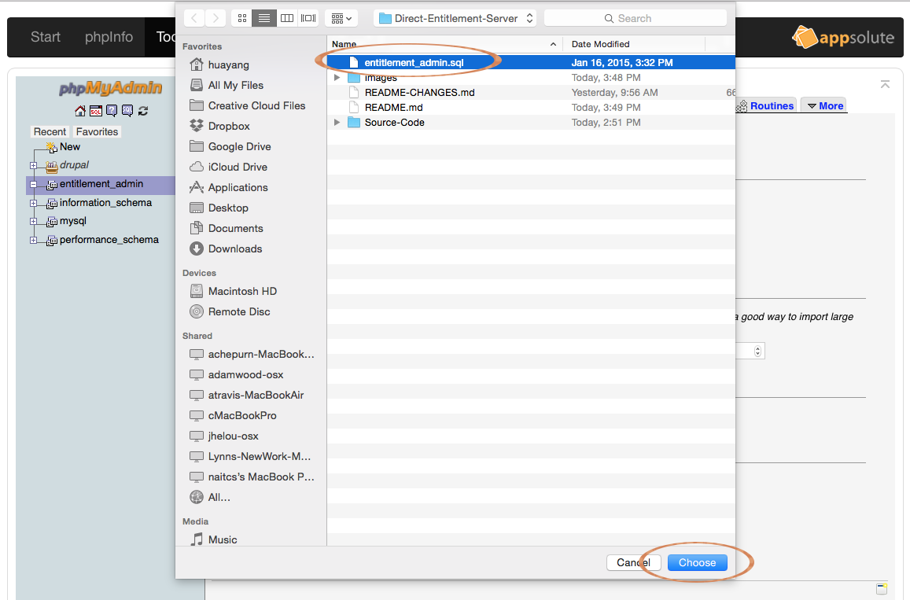
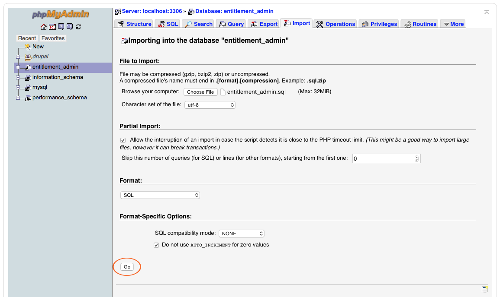
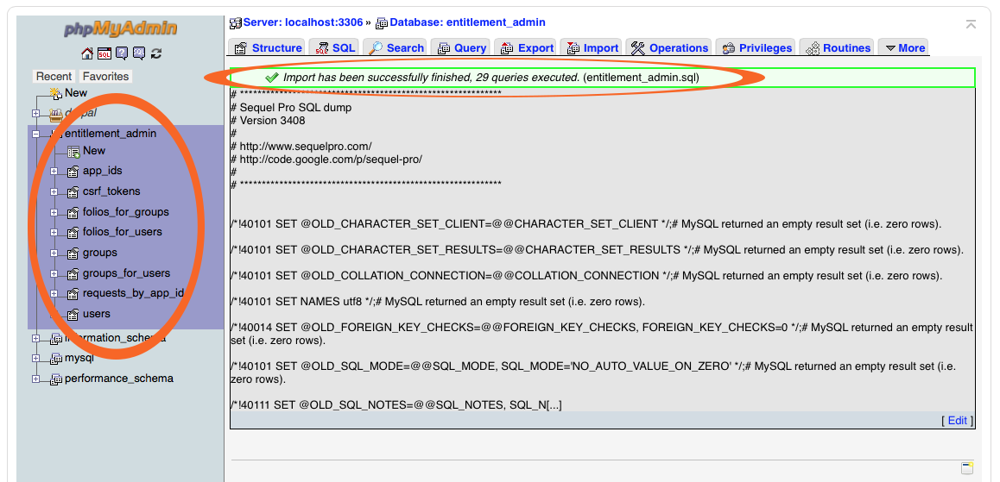
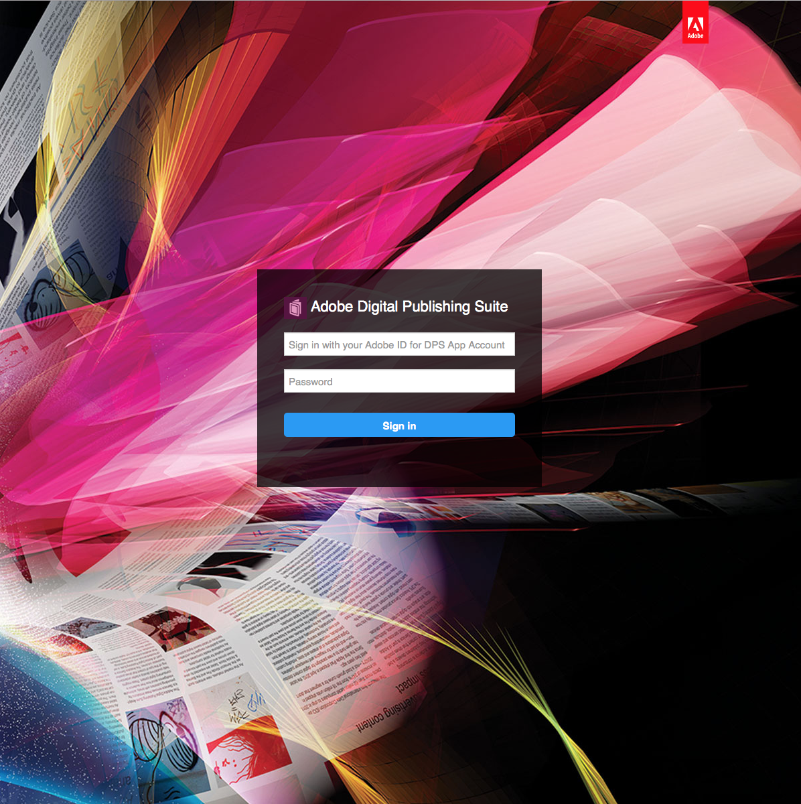

## Requirement

* A server with MySQL and PHP installed.
* A __MySQL__ user account
* A __Digital Publishing Suite__ user account
* For advanced customization
	- Understanding of Web Design languages: HTML, CSS, JavaScript
	- Understanding of server-side scripting language: PHP

## Installation

#### MySQL

1. Navigate to the __phpMyAdmin__ page on the server with MySQL and PHP installed
2. Navigate to the page to create new database in the MySQL database, by clicking either the `New` option on the left sidebar or the `database` tab on the top navigation bar.

3. Enter the database name __entitlement\_admin__ (preferably), or a name of your choice, into the `Database name` field on the page.

4. Generate the new database with name __entitlement\_admin__, or the name you entered in step 3, by clicking the `Create` button on the right.

5. Select the new database by clicking the new database name in the list.

6. Navigate to the import page to import the necessary database structure, by clicking the `Import` tab on the top navigation bar.

7. Open the browse window to select the existing database (.sql) by clicking the `Choose File` option.

8. Select the existing database file from the new window, __entitlement_admin.sql__, and click the `Choose` button to confirm.

9. Upload the selected database (.sql) by clicking on the `Go` button.

10. If the database was successfully created, there will be a message similar to the following: _Import has been successfully finished_.

#### Configuration

* Open the file `settings.php` with an text editor, located in the `Source-Code/php/settings.php`, and update the values for the following parameters:
    * __$db_host__, set this to the MySQL host name
    * __$db_user__, set this to the MySQL account user name, default is root
    * __$db_password__, set this to the MySQL account password, default is root
    * __$db_name__, set this to the MySQL database name, created in step 3 of [MySQL](#mysql) installation process.

#### Website

* Upload all the files within the folder __Source-Code__ to the root directory of a server with MySQL and PHP installed.
* Navigate to the index.html page from the server to see the login screen.

